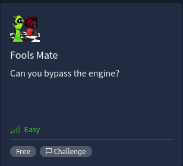
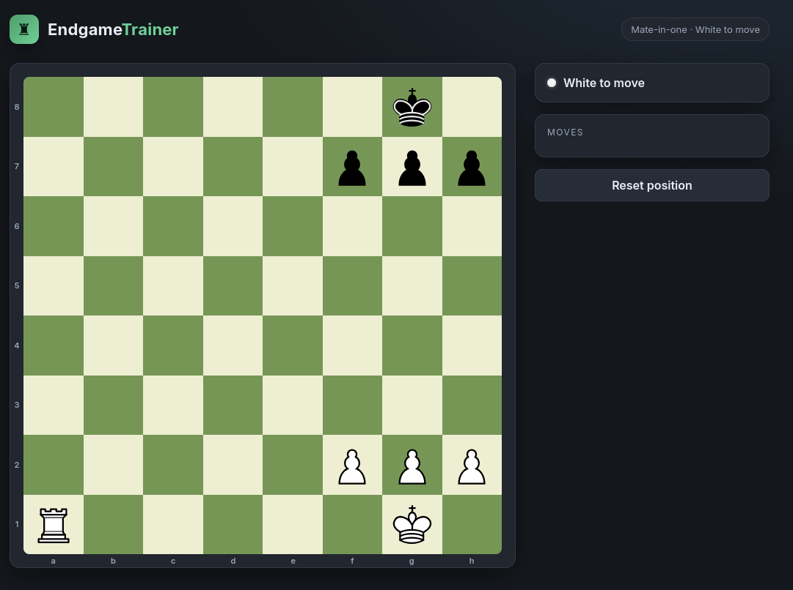
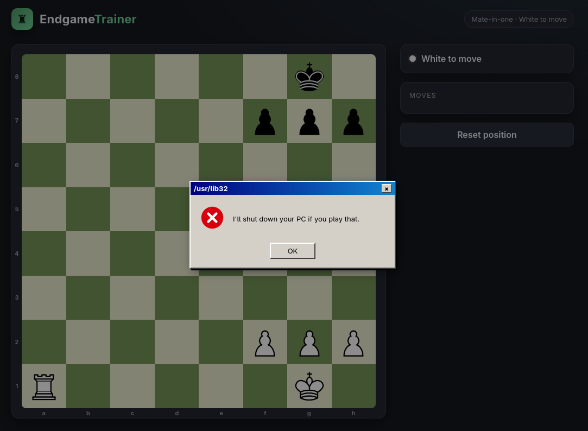
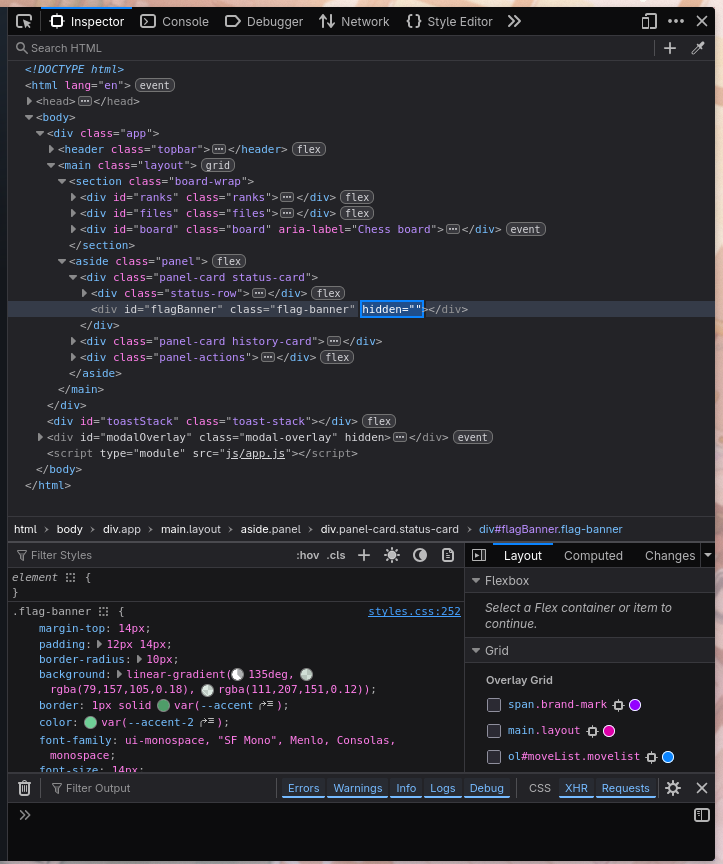
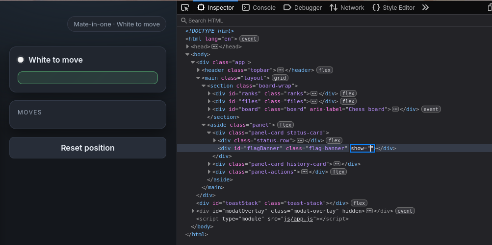
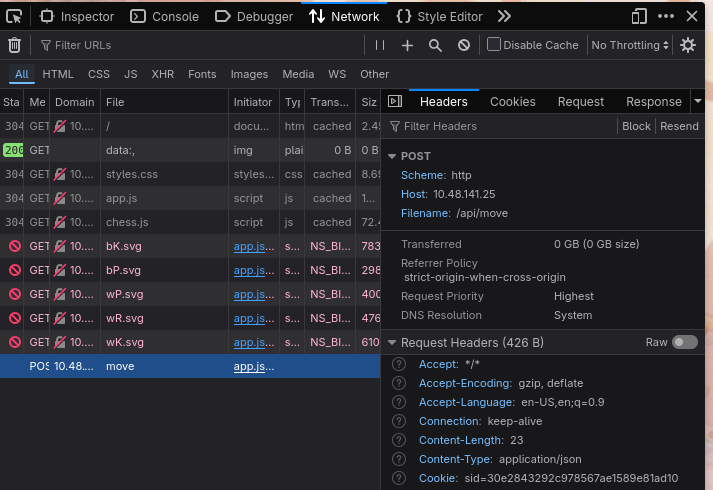
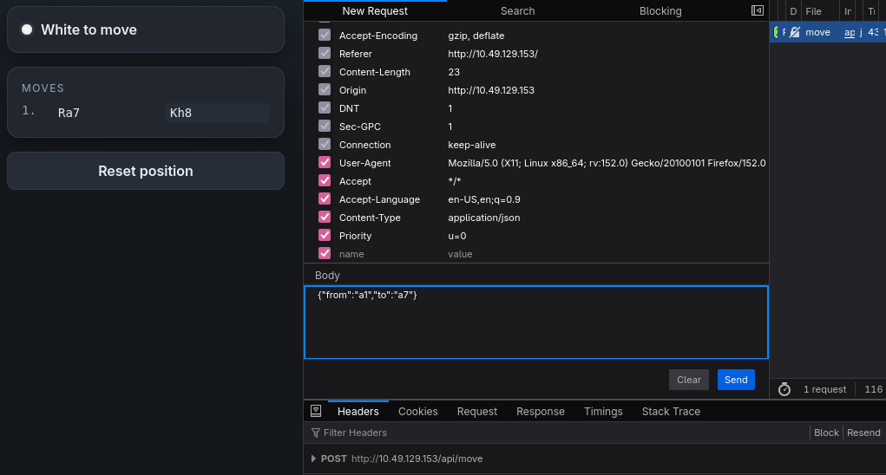
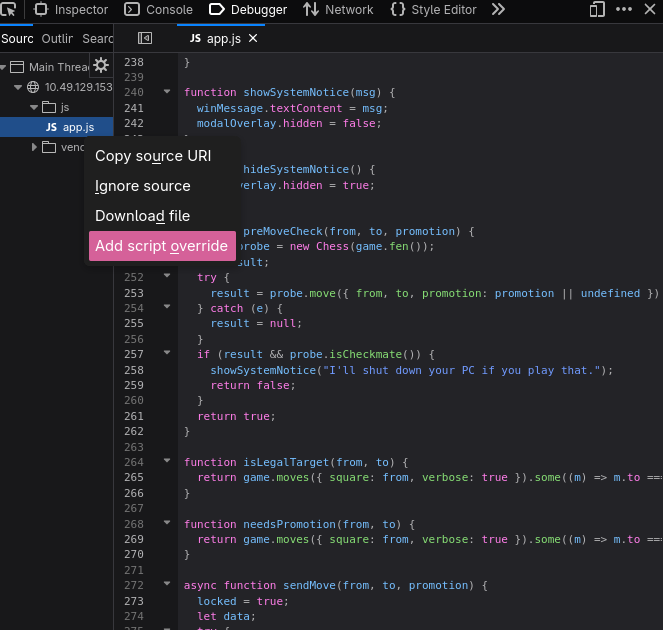
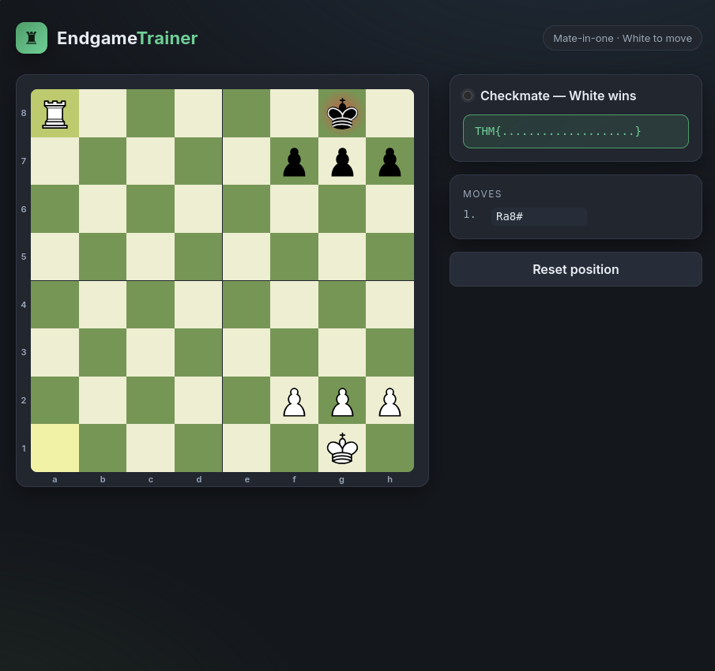

# ♟️ Fool’s Mate — TryHackMe

[https://tryhackme.com/room/foolsmate](https://tryhackme.com/room/foolsmate)



Released on July 4 2026, fool’s mate is an **easy** room hosted on TryHackMe that claims to take 15 minutes to solve (yet it took me over 2 hours). The machine featured a basic chess trainer website that requires you to outsmart the bot to get to the flag. The chess puzzle inside was a very straightforward mate-in-one, so no chess skills needed (trust me I’m 300 elo) — however, it will surely test your web hacking and Javascript code reading skills. Since it was a newly released room on tryhackme, I got over 45 points after solving it.

## 🗞️ Abstract

The flag was captured through forcing a state in the client-side to accept the mate-in-one loss condition. This was achieved by overriding the `app.js` file via a built-in browser DevTools then changing a single line of return statement.

## 🔍 Reconnaissance

- **Nmap**

Running `nmap -sV -sC` on the machine I.P. revealed two ports and services open and running, namely port 22 (OpenSSH) and port 80 (HTTP web server). 

```bash
mclnoot@mcdesktop ~ nmap -sV -sC 10.48.141.25
PORT   STATE SERVICE VERSION
22/tcp open  ssh     OpenSSH 9.6p1 Ubuntu 3ubuntu13.16 (Ubuntu Linux; protocol 2.0)
80/tcp open  http    Node.js Express framework
|_http-title: Endgame Trainer
Service Info: OS: Linux; CPE: cpe:/o:linux:linux_kernel

```

Our main focus here is our HTTP server which hosts the website we need to attack. 

Opening `10.48.141.25:80` shows us the website we need to attack.



- **Gobuster**

Since, we are attacking a web server, my first instinct was to run a directory check if there are any hidden files or pages that can lead us to the flag.

```bash
mclnoot@mcdesktop ~ gobuster dir -u http://10.48.141.25 -w Documents/wordlist.txt
===============================================================
Starting gobuster in directory enumeration mode
===============================================================
js                   (Status: 301) [Size: 152] [--> /js/]
css                  (Status: 301) [Size: 153] [--> /css/]
vendor               (Status: 301) [Size: 156] [--> /vendor/]
Progress: 1828 / 1828 (100.00%)
===============================================================
Finished!
```

However our gobuster scan was pretty dissapointing. Each directory just contained some basic files needed by the website such as our `js/app.js` for providing the main function for our website, `css/styles.css` for it’s stylesheet, and `/vendor/chess.js` for the main code of the chess engine a.k.a the move generation algorithm.

## 💻 The website

As a chess trainer site, it should motivate us to play the correct set of moves in order to win the game (spoilers!). However, playing the winning move here - Ra7 (rook to a7 on the board) presents us with a warning not to play that move — preventing us from winning the mate-in-one. 



This is crucial because based on the room’s description, this move has got something to do with our flag, and this website has prevented us from doing that move — quite suspicious i should say.

## 🏞️ The Adventure

### Inspect

After gathering all the data we needed for our reconnaissance, it is time to focus our attention onto the bigger fish. As we recall from our web hacking lessons, we need to dive into the website’s internal parts. Here we will use our DevTools and view page source features of our browser.



Digging deeper with our inspection, we can see that there is a hidden `div` section of our website’s frontpage which could definitely be where our flag is shown when we solve the puzzle.



Modifying the visibility of the div from `hidden=""` to `show=""` reveals a green banner that has a design that screams “SUCCESS!” which confirms that this is where the flag should shown (if the id and class names aren’t convincing enough).

### Dead end

Interestingly, every move i made in the chess board sends out a POST API call to which I assume was to a back-end.



My instinct was to edit the POST request's JSON payload to force the mate-in-one loss condition — changing it from `{"from":"a1","to":"a7"}` to `{"from":"a1","to":"a8"}` then resending it to the backend.



But then…. nothing happened, no change in the frontpage, no flags revealed, nothing. I tried messing with the API calls but it was totally a dead end — unless I’m missing something, but i scrapped that anyway.

Another interesting note was that the chess pieces’ sprites are stored in a directory called `/pieces` for example `/pieces/bK.svg` for Snuffing through the directory of `/pieces/` lead to nothing. I tried different combinations of `/pieces/flag.txt` and `/pieces/flag` but it was also a dead end.

So i had to conclude that there were no backends and the flag must be stored in the client-side instead.

## 🏁 The Flag

Further digging through the website’s source code has been made using the `view-source:` feature and I have made the following observations:

- In the `app.js` file, there is a function that is used to update the flag banner in the frontend (the div element we found earlier) on line 223-226.

```jsx
function showFlag(flag) {
  flagBanner.hidden = false;
  flagBanner.textContent = flag;
}
```

and this on line 318-322:

```jsx
function finalize(data) {
  refreshHighlights();
  updateStatus();
  if (data.flag) showFlag(data.flag);
}
```

But what’s even more important is this function on line 249-262:

```jsx
function preMoveCheck(from, to, promotion) {
  const probe = new Chess(game.fen());
  let result;
  try {
    result = probe.move({ from, to, promotion: promotion || undefined });
  } catch (e) {
    result = null;
  }
  if (result && probe.isCheckmate()) {
    showSystemNotice("I'll shut down your PC if you play that.");
    return false;
  }
  return true;
}
```

This is the function that was preventing us from checkmating the engine and providing us the flag. By setting the return statement of `if (result && probe.isCheckmate()) {` to true, the popup message won’t bother us anymore and it wouldn't prevent us anymore from checkmating using the Rook.

All we have to do now is to go into our devtools, then into the debugging tab, and now we find `app.js` right click then set a script override; changing the return statement from `false` to `true` .



Reload our page, then play the winning move:



**And Ta-Da!!!!!!** We have now captured the flag! And it actually showed up through the hidden banner we found earlier now populated with `THM{R3d4cTeD_0bVi0uslY}`.

So what did we learn? never skip a chess lesson.
